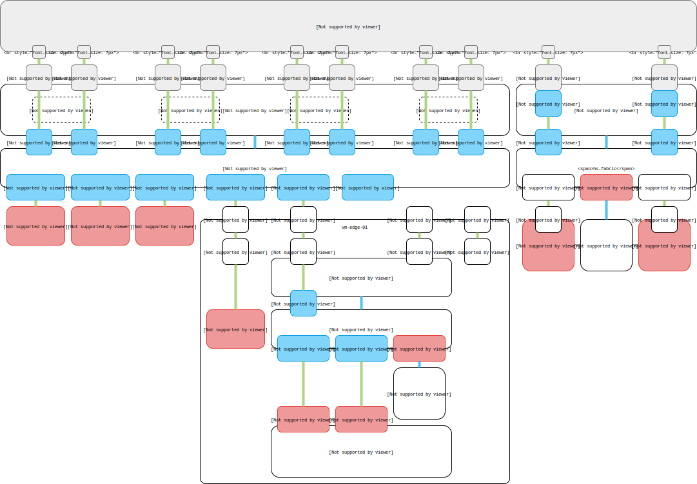

## Hacking
A collection of personally useful TL;DRs for various hacking activities  
In the spirit of hacking and collaboration - I have written this info in markdown (md) and hosted it on github here:  
https://github.com/apnex/hacking

### Markdown
For further info on markdown syntax:  
https://www.markdowntutorial.com  
https://commonmark.org/help/tutorial  
https://commonmark.org/help  

### GitHub
Useful for hosting and sharing public code or documentation related content.  
Makes it easy for others to view, fork and contribute modifications to content.  
Sign up here:  
https://github.com

#### useful commands
Start by creating a new repository (repo) as per:  
https://help.github.com/articles/create-a-repo

Once you have done that, ensure you have `git` installed for your OS (via brew, dnf, yum, apt-get etc..):  
https://www.atlassian.com/git/tutorials/install-git

Now you should be able to `clone` the new repo you created locally to your machine to work on it:  
```
git clone https://github.com/apnex/hacking
```
**where**
- `apnex` is your github account name
- `hacking` is your newly create repo name

This will create a fresh local directory that will start mostly empty - create some new files.  
Make sure to create a `readme.md` file to document any useful information about this repo (see this file for inspiration)  
When ready, `commit` your changes with a message to sync them to your online repo here then sync them upstream:  
```
git add .
git commit -m 'initial upload of files...'
git push origin master
```

### Some useful tools
Some info on some of the tools I discussed and presented

#### vmw-cli
`vmw-cli` is a CLI client used to login and interact with my.vmware.com.  
It provides an interface for programmatic query and download of VMware product binaries.  
Requires nodejs 8.x + npm installed if using native, or via conveniently packaged docker.   
Further info and uses can be found:  
https://github.com/apnex/vmw-cli

#### examples (via npm) as root!
download nsx appliance
```
npm install vmw-cli --global
vmw-cli index NSX-T-230
vmw-cli find unified
vmw-cli get nsx-unified-appliance-2.3.0.0.0.10085405.ova
```

#### nsx API scripts
This repository contains a collection of CLI scripts written to interact with the NSX-T REST API
https://github.com/apnex/nsx

#### vcenter API scripts
This repository contains a collection of CLI scripts written to interact with the vCenter REST API
https://github.com/apnex/vsp

#### asciinema / asciicast
`asciinema` is a free hosted service that allows you to record text in terminals and play them back  
It allows you to upload your recorded terminal session and freely embed and share them with others  
`asciicast` is the resultant file format used for a recording - entirely text - stupidly small (take that GIF!)  
https://github.com/asciinema/asciinema  
https://asciinema.org  
https://asciinema.org/docs/installation  
https://asciinema.org/docs/how-it-works  

#### svg-term-cli
This tool takes an `asciicast` file and converts it into a browser friendly SVG animated image  
Allows you to easily embed these images in a local browser or into a blog for example  
This is an alternative to hosting your `asciicast` animation on the `asciinema` service   
https://github.com/apnex/svg-term-cli


#### demo magic
This is the original demo magic script that actually executes keystrokes in a pre-scripted fashion  
Useful for live demos where you want to avoid fat fingering  
https://github.com/paxtonhare/demo-magic

### Drawing
#### draw.io
A html5 based vector drawing tool that supports in-browser and local installation options.  
Highly portable cross-OS (windows, mac, linux), and supports a number of local and online integrations.  
Useful for technical system or network diagrams.  

##### use directly in browser
https://www.draw.io

##### download local client  
https://about.draw.io/integrations/#integrations_offline

##### load a drawing from a URL link (if using chrome)  
useful for sharing public drawings that are hosted on github for example:  
`https://www.draw.io/?url=#<url>`

##### example


I put `edge-design.xml` file in my `diagrams` folder first - and reference it in the draw.io link  
https://www.draw.io/?#Uhttps://raw.githubusercontent.com/apnex/hacking/master/diagrams/edge-design.xml
